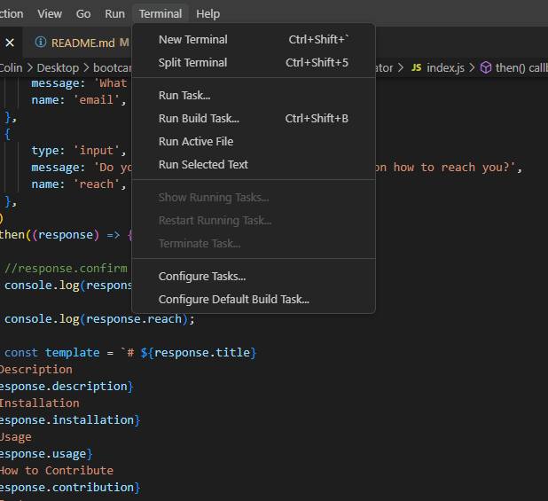
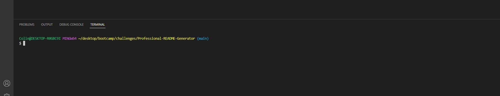
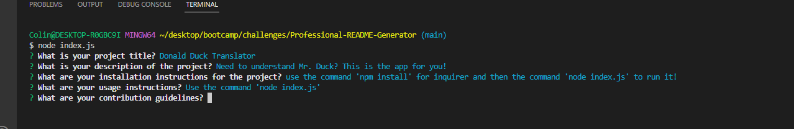

# Professional-README-Generator
A command-line interface that generates a README file based on their input.

## Description

This is an application that runs on the user's command line that takes their input and generates a README file based on that. README files are required for all projects and are useful to any potential contributors and users by explaining installation, usage, and giving guidelines
on how to contribute to the project and contact the team behind the project.

## Installation
Open an instance of your terminal, navigate to the project folder in GitBash, run the 'npm install' commnand to download Inquirer, then run the command 'node index.js'. You will be taken through a series of questions and a README file will be generated!

## Usage

Run the command 'node index.js' and go through the series of questions and a README file with your input will be automatically generated! 

To add a screenshot, create an `assets/images` folder in your repository and upload your screenshot to it. Then, using the relative filepath, add it to your README using the following syntax:

    

